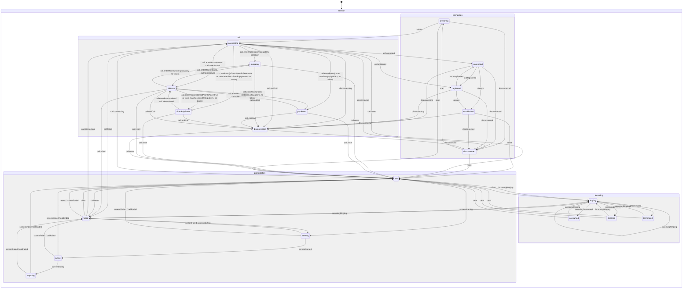

# Модель состояний сеанса (XState)

Sip-connector публикует единый XState-актор сеанса, агрегирующий параллельные машины по доменам: соединение, звонок, входящий звонок, шаринг экрана. Клиент получает только подписку на их статусы, бизнес-логика остаётся внутри sip-connector.

## Диаграмма состояний



## Слои

- Каждая машина состояний поднимается внутри своего менеджера: `connectionManager.stateMachine`, `callManager.stateMachine`, `incomingCallManager.stateMachine`, `presentationManager.stateMachine`.
- Менеджеры сами отправляют доменные события в свои машины.
- Агрегатор: `sipConnector.session` подписывается на `.subscribe` машин менеджеров и отдаёт объединённый снапшот + типобезопасные селекторы.

## Доменные статусы и события

| Домен        | Статусы                                                                                                      | Источники событий                                                                                                                                                                                                      | Доменные события                                                                                                                     |
| :----------- | :----------------------------------------------------------------------------------------------------------- | :--------------------------------------------------------------------------------------------------------------------------------------------------------------------------------------------------------------------- | :----------------------------------------------------------------------------------------------------------------------------------- |
| Connection   | `idle`, `preparing`, `connecting`, `connected`, `registered`, `established`, `disconnecting`, `disconnected` | `ConnectionManager.events` (`connect-started`, `connecting`, `connect-parameters-resolve-success`, `connected`, `registered`, `unregistered`, `disconnecting`, `disconnected`, `registrationFailed`, `connect-failed`) | `START_CONNECT`, `START_INIT_UA`, `START_DISCONNECT`, `UA_CONNECTED`, `UA_REGISTERED`, `UA_UNREGISTERED`, `UA_DISCONNECTED`, `RESET` |
| Call         | `idle`, `connecting`, `purgatory`, `p2pRoom`, `directP2pRoom`, `inRoom`, `disconnecting`                     | `CallManager.events` (`start-call`, `end-call`, `enter-room`, `conference:participant-token-issued`, `ended`, `failed`)                                                                                                | `CALL.CONNECTING`, `CALL.ENTER_ROOM`, `CALL.TOKEN_ISSUED`, `CALL.START_DISCONNECT`, `CALL.RESET`                                     |
| Incoming     | `idle`, `ringing`, `consumed`, `declined`, `terminated`, `failed`                                            | `IncomingCallManager.events` (`incomingCall`, `declinedIncomingCall`, `terminatedIncomingCall`, `failedIncomingCall`) + синтетика при ответе на входящий                                                               | `INCOMING.RINGING`, `INCOMING.CONSUMED`, `INCOMING.DECLINED`, `INCOMING.TERMINATED`, `INCOMING.FAILED`, `INCOMING.CLEAR`             |
| Presentation | `idle`, `starting`, `active`, `stopping`, `failed`                                                           | `CallManager.events` (`presentation:start\|started\|end\|ended\|failed`), `ConnectionManager.events` (`disconnected`, `registrationFailed`, `connect-failed`)                                                          | `SCREEN.STARTING`, `SCREEN.STARTED`, `SCREEN.ENDING`, `SCREEN.ENDED`, `SCREEN.FAILED`, `PRESENTATION.RESET`                          |

## API для клиентов

- `sipConnector.session`: агрегатор снапшотов машин менеджеров и утилиты подписки.
- `getSnapshot()` — текущее состояние всех доменов.
- `subscribe(selector, listener)` — типобезопасная подписка на срез состояния (например, `selectConnectionStatus`).
- `stop()` — очистка подписок на машины менеджеров.
- Доступ к машинам: `sipConnector.session.machines` (connection, call, incoming, presentation).

## Инварианты и гварды

- `presentation` может быть `active` только если `call` в `inRoom`.
- `incoming` сбрасывается в `idle` при сбросе/завершении звонка (`CALL.RESET`; событие `ended` или `failed` приводит к CALL.RESET).
- `connection` `disconnecting` / `disconnected` приводит к сбросу `call` и `presentation` → `idle`.

## Детальное описание машин состояний

### ConnectionStateMachine (Состояния соединения)

- Внутренний компонент ConnectionManager
- Управление состояниями SIP соединения через XState
- Валидация допустимых операций с предотвращением некорректных переходов
- **Логика состояний:**
  - `PREPARING` — подготовка к подключению (до инициализации UA, до вызова `ua.start()`)
  - `CONNECTING` — UA запущен, идет подключение (после `ua.start()`, когда приходят события `connecting`, `connected`, `registered`)
  - `CONNECTED` — UA подключен к серверу (промежуточное состояние, автоматически переходит в `ESTABLISHED`)
  - `REGISTERED` — UA зарегистрирован на сервере (промежуточное состояние, автоматически переходит в `ESTABLISHED`)
  - `ESTABLISHED` — соединение установлено и готово к работе (финальное активное состояние, автоматически достигается из `CONNECTED` или `REGISTERED`)
  - `DISCONNECTING` — процесс отключения (начат вызов `disconnect()`, ожидаем `disconnected` от UA)
  - `DISCONNECTED` — соединение отключено (в т.ч. при ошибках: registrationFailed, connect-failed)
  - Состояния переименованы для соответствия реальной последовательности операций: сначала подготовка, затем подключение UA
- Публичный API:
  - Геттеры состояний: `isIdle`, `isPreparing`, `isConnecting`, `isConnected`, `isRegistered`, `isEstablished`, `isDisconnecting`, `isDisconnected`
  - Комбинированные геттеры: `isPending` (preparing/connecting), `isPendingConnect`, `isPendingInitUa`, `isActiveConnection` (connected/registered/established)
  - Методы управления: `startConnect()`, `startInitUa()`, `startDisconnect()`, `reset()`
  - Методы валидации: `canTransition()`, `getValidEvents()`
  - Подписка на изменения: `onStateChange(listener)`
- Корректный граф переходов:
  - IDLE → PREPARING → CONNECTING → CONNECTED → ESTABLISHED (автоматически)
  - IDLE → PREPARING → CONNECTING → REGISTERED → ESTABLISHED (автоматически)
  - Прямой переход CONNECTING → REGISTERED (для быстрой регистрации без явного connected)
  - Переход REGISTERED → CONNECTED → ESTABLISHED (через `UA_UNREGISTERED`, затем автоматически)
  - Переходы в DISCONNECTING из CONNECTING/CONNECTED/REGISTERED/ESTABLISHED (событие `disconnecting` / `START_DISCONNECT`)
  - Переход DISCONNECTING → DISCONNECTED (событие `disconnected` / `UA_DISCONNECTED`)
  - Переходы в DISCONNECTED из PREPARING/CONNECTING/CONNECTED/REGISTERED/ESTABLISHED (в т.ч. при registrationFailed, connect-failed)
  - Переходы RESET: ESTABLISHED→IDLE, DISCONNECTED→IDLE
  - Переход из DISCONNECTED: → PREPARING (повторное подключение через `START_CONNECT`)
  - Автоматические переходы через `always`: CONNECTED → ESTABLISHED, REGISTERED → ESTABLISHED
  - В состоянии ESTABLISHED события `UA_REGISTERED` и `UA_UNREGISTERED` игнорируются (нет обработчиков)
- Логирование всех переходов и недопустимых операций

### CallStateMachine (Состояния звонка)

- Внутренний компонент CallManager
- Управление состояниями звонка через XState
- Валидация переходов с предотвращением недопустимых операций (проверка `snapshot.can(event)` перед отправкой)
- События: `CALL.CONNECTING`, `CALL.ENTER_ROOM`, `CALL.TOKEN_ISSUED`, `CALL.START_DISCONNECT`, `CALL.RESET`. События `end-call`, `ended`, `failed` от CallManager.events приводят к соответствующим переходам.
- Публичный API:
  - Геттеры состояний: `isIdle`, `isConnecting`, `isInPurgatory`, `isP2PRoom`, `isDirectP2PRoom`, `isInRoom`, `isDisconnecting`
  - Комбинированные геттеры: `isPending` (connecting/disconnecting), `isActive` (inRoom, purgatory, p2pRoom или directP2pRoom)
  - Геттер контекста: `inRoomContext` (возвращает контекст только в состоянии IN_ROOM). Методы: `reset()`, `send(event)`, `subscribeToApiEvents(apiManager)` для привязки к API (enter-room, conference:participant-token-issued)
- Корректный граф переходов:
  - IDLE → CONNECTING (CALL.CONNECTING)
  - CONNECTING → PURGATORY (при CALL.ENTER_ROOM с room=purgatory без token)
  - CONNECTING → P2P_ROOM (при CALL.ENTER_ROOM с room, соответствующим паттерну `/^p2p.+to.+$/i`, без token)
  - CONNECTING → DIRECT_P2P_ROOM (при CALL.ENTER_ROOM с `isDirectPeerToPeer=true` или room, соответствующим паттерну `/^directP2P.+to.+$/i`, без token)
  - CONNECTING → IN_ROOM (при получении room + participantName и token через CALL.ENTER_ROOM и CALL.TOKEN_ISSUED)
  - CONNECTING → DISCONNECTING (CALL.START_DISCONNECT; событие `end-call`)
  - CONNECTING → IDLE (CALL.RESET; в т.ч. при событии `ended` или `failed`)
  - PURGATORY → IN_ROOM (при появлении token: CALL.ENTER_ROOM с bearerToken — можно сменить комнату; или CALL.TOKEN_ISSUED — room остаётся purgatory)
  - PURGATORY → DISCONNECTING (CALL.START_DISCONNECT; событие `end-call`)
  - PURGATORY → IDLE (CALL.RESET)
  - P2P_ROOM → IN_ROOM (при появлении token через CALL.ENTER_ROOM с bearerToken или CALL.TOKEN_ISSUED)
  - P2P_ROOM → DISCONNECTING (CALL.START_DISCONNECT; событие `end-call`)
  - P2P_ROOM → IDLE (CALL.RESET)
  - DIRECT_P2P_ROOM → IN_ROOM (при появлении token через CALL.ENTER_ROOM с bearerToken или CALL.TOKEN_ISSUED)
  - DIRECT_P2P_ROOM → DISCONNECTING (CALL.START_DISCONNECT; событие `end-call`)
  - DIRECT_P2P_ROOM → IDLE (CALL.RESET)
  - IN_ROOM → PURGATORY (при CALL.ENTER_ROOM с room=purgatory без token; в setRoomInfo token сбрасывается только для room=purgatory)
  - IN_ROOM → P2P_ROOM (при CALL.ENTER_ROOM с room, соответствующим паттерну `/^p2p.+to.+$/i`, без token)
  - IN_ROOM → DIRECT_P2P_ROOM (при CALL.ENTER_ROOM с `isDirectPeerToPeer=true` или room, соответствующим паттерну `/^directP2P.+to.+$/i`, без token)
  - IN_ROOM → DISCONNECTING (CALL.START_DISCONNECT; событие `end-call`)
  - IN_ROOM → IDLE (CALL.RESET)
  - DISCONNECTING → IDLE (CALL.RESET; в т.ч. при событии `ended` или `failed`)
- Внутреннее состояние EVALUATE: переход в DISCONNECTING (при `prepareDisconnect`/`pendingDisconnect`), IN_ROOM, DIRECT_P2P_ROOM, P2P_ROOM, PURGATORY, CONNECTING или IDLE по контексту после действий. Переход в DISCONNECTING идёт через EVALUATE: `CALL.START_DISCONNECT` → `EVALUATE` (action `prepareDisconnect`: очистка контекста + флаг `pendingDisconnect`) → `DISCONNECTING` (action `reset` для сброса флага)
- Логика определения состояний:
  - **DIRECT_P2P_ROOM**: приоритет выше P2P_ROOM; определяется по флагу `isDirectPeerToPeer=true` в событии `enter-room` или по паттерну имени комнаты `/^directP2P.+to.+$/i`
  - **P2P_ROOM**: определяется по паттерну имени комнаты `/^p2p.+to.+$/i` (без префикса `direct`)
  - Оба состояния P2P не требуют токена (как и PURGATORY), но могут перейти в IN_ROOM при получении токена
- Логирование недопустимых переходов через console.warn
- **Зависимость для перевода в зрители**: запуск RecvSession (и вызов sendOffer) возможен только при наличии токена (состояние IN_ROOM). При гонке событий (`participant:move-request-to-spectators-with-audio-id` приходит до `conference:participant-token-issued`) CallManager использует DeferredCommandRunner: команда откладывается и выполняется при переходе в IN_ROOM.

### PresentationStateMachine (Состояния демонстрации экрана)

- Внутренний компонент PresentationManager
- Управление состояниями демонстрации экрана через XState
- Валидация допустимых операций с предотвращением некорректных переходов
- Типобезопасная обработка ошибок (lastError: Error | undefined)
- Публичный API:
  - Геттеры состояний: `isIdle`, `isStarting`, `isActive`, `isStopping`, `isFailed`
  - Комбинированные геттеры: `isPending` (starting/stopping), `isActiveOrPending` (active/starting/stopping)
  - Геттер ошибки: `lastError`
  - Методы управления: `reset()`
- Корректный граф переходов:
  - IDLE → STARTING → ACTIVE → STOPPING → IDLE
  - Переходы в FAILED из STARTING/ACTIVE/STOPPING (через SCREEN.FAILED или при сбросе звонка — событие `failed`)
  - Переход RESET: FAILED → IDLE
  - Убран нелогичный переход IDLE → FAILED (презентация не может зафейлиться до старта)
  - Прерывание при сбросе звонка (ended/failed → CALL.RESET) из любого активного состояния (STARTING/ACTIVE/STOPPING)
- Автоматическое создание Error из не-Error значений (JSON.stringify для объектов)
- Полное логирование всех переходов состояний и недопустимых операций через console.warn

### IncomingCallStateMachine (Состояния входящих звонков)

- Внутренний компонент IncomingCallManager
- Управление состояниями входящих SIP-звонков через XState
- Валидация допустимых операций с предотвращением некорректных переходов
- Хранение данных вызывающего абонента (remoteCallerData)
- Публичный API:
  - Геттеры состояний: `isIdle`, `isRinging`, `isConsumed`, `isDeclined`, `isTerminated`, `isFailed`
  - Комбинированные геттеры: `isActive` (ringing), `isFinished` (consumed/declined/terminated/failed)
  - Геттеры контекста: `remoteCallerData`, `lastReason`
  - Методы управления: `reset()`, `toConsumed()`
- Корректный граф переходов:
  - IDLE → RINGING (новый входящий звонок)
  - RINGING → CONSUMED (принят) / DECLINED (отклонен) / TERMINATED (обрыв) / FAILED (ошибка)
  - Все финальные состояния → IDLE (через CLEAR)
  - Все финальные состояния → RINGING (новый входящий звонок)
  - Self-transition: RINGING → RINGING (повторный входящий звонок)
- Автоматическая очистка при потере соединения (через ConnectionManager events: disconnected, registrationFailed, connect-failed)
- Полное логирование всех переходов состояний и недопустимых операций через console.warn

## Комбинированное состояние системы (ESystemStatus)

Для упрощения работы клиентов с состоянием системы создан механизм комбинирования состояний Connection и Call машин в единое состояние `ESystemStatus`. Это позволяет клиенту однозначно определить текущее состояние системы без необходимости анализировать комбинации состояний вручную.

### Логика приоритетов

При определении комбинированного состояния применяется следующая логика приоритетов:

1. **Активный звонок имеет наивысший приоритет** — если call в активном состоянии (IN_ROOM, PURGATORY, P2P_ROOM, DIRECT_P2P_ROOM), возвращается `CALL_ACTIVE` независимо от состояния connection
2. **Если connection IDLE/DISCONNECTED** → `DISCONNECTED`
3. **Если connection DISCONNECTING** → `DISCONNECTING` (если call не в активном состоянии)
4. **Если connection PREPARING/CONNECTING/CONNECTED/REGISTERED** → `CONNECTING` (независимо от состояния call)
5. **Если connection ESTABLISHED**:
   - call IDLE → `READY_TO_CALL`
   - call CONNECTING → `CALL_CONNECTING`
   - call DISCONNECTING → `CALL_DISCONNECTING`
   - call PURGATORY, call P2P_ROOM, call DIRECT_P2P_ROOM или call IN_ROOM → `CALL_ACTIVE` (обработано в пункте 1)
   - неизвестный call status → fallback `READY_TO_CALL`

### Состояния ESystemStatus

| Состояние            | Описание                                 | Условия                                                                         |
| :------------------- | :--------------------------------------- | :------------------------------------------------------------------------------ |
| `DISCONNECTED`       | Система не подключена                    | connection: IDLE или DISCONNECTED                                               |
| `DISCONNECTING`      | Идет процесс отключения                  | connection: DISCONNECTING                                                       |
| `CONNECTING`         | Идет процесс подключения                 | connection: PREPARING, CONNECTING, CONNECTED или REGISTERED                     |
| `READY_TO_CALL`      | Соединение установлено, готово к звонкам | connection: ESTABLISHED, call: IDLE                                             |
| `CALL_CONNECTING`    | Идет установка звонка                    | connection: ESTABLISHED, call: CONNECTING                                       |
| `CALL_DISCONNECTING` | Идет процесс отключения звонка           | connection: ESTABLISHED, call: DISCONNECTING                                    |
| `CALL_ACTIVE`        | Звонок активен                           | connection: ESTABLISHED, call: IN_ROOM, PURGATORY, P2P_ROOM или DIRECT_P2P_ROOM |

### Использование

```typescript
import { sessionSelectors, ESystemStatus } from '@krivega/sip-connector';

// Подписка на комбинированное состояние
sipConnector.session.subscribe(sessionSelectors.selectSystemStatus, (status) => {
  switch (status) {
    case ESystemStatus.READY_TO_CALL:
      // Система готова к звонкам
      break;
    case ESystemStatus.CALL_CONNECTING:
      // Идет установка звонка
      break;
    case ESystemStatus.CALL_DISCONNECTING:
      // Идет процесс отключения звонка
      break;
    case ESystemStatus.CALL_ACTIVE:
      // Звонок активен
      break;
    // ... другие состояния
  }
});
```

### Преимущества

- **Однозначность**: клиент получает одно значение вместо необходимости анализировать комбинацию двух состояний
- **Приоритет соединения**: состояние соединения автоматически учитывается при определении состояния системы
- **Типобезопасность**: enum обеспечивает проверку типов на этапе компиляции
- **Простота использования**: один селектор вместо комбинации двух

## Тестирование

- Табличные тесты для переходов каждой машины.
- Контрактный тест адаптера событий: события менеджеров → доменные события → ожидаемые статусы.
- Smoke-тест фасада `sipConnector.session`: подписка, снапшоты, доступ к машинам, очистка.
