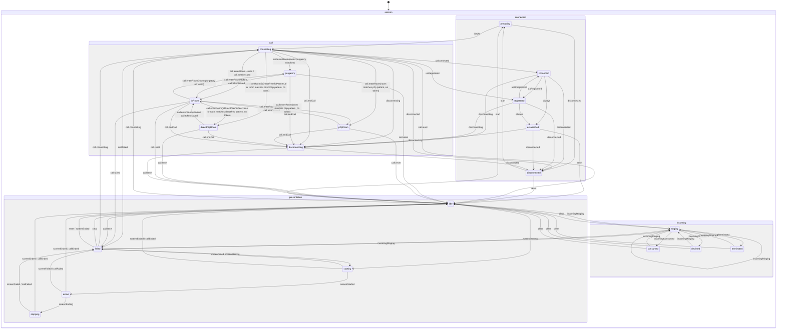

# Модель состояний сеанса (XState)

Sip-connector публикует единый XState-актор сеанса, агрегирующий параллельные машины по доменам: соединение, звонок, входящий звонок, шаринг экрана. Клиент получает только подписку на их статусы, бизнес-логика остаётся внутри sip-connector.

## Диаграмма состояний

## Слои

- Каждая машина состояний поднимается внутри своего менеджера: `connectionManager.stateMachine`, `callManager.stateMachine`, `incomingCallManager.stateMachine`, `presentationManager.stateMachine`.
- Менеджеры сами отправляют доменные события в свои машины.
- Агрегатор: `sipConnector.session` подписывается на `.subscribe` машин менеджеров и отдаёт объединённый снапшот + типобезопасные селекторы.

## Доменные статусы и события

| Домен        | Статусы                                                                                                      | Источники событий                                                                                                                                                                                                      | Доменные события                                                                                                                     |
| :----------- | :----------------------------------------------------------------------------------------------------------- | :--------------------------------------------------------------------------------------------------------------------------------------------------------------------------------------------------------------------- | :----------------------------------------------------------------------------------------------------------------------------------- |
| Connection   | `idle`, `preparing`, `connecting`, `connected`, `registered`, `established`, `disconnecting`, `disconnected` | `ConnectionManager.events` (`connect-started`, `connecting`, `connect-parameters-resolve-success`, `connected`, `registered`, `unregistered`, `disconnecting`, `disconnected`, `registrationFailed`, `connect-failed`) | `START_CONNECT`, `START_INIT_UA`, `START_DISCONNECT`, `UA_CONNECTED`, `UA_REGISTERED`, `UA_UNREGISTERED`, `UA_DISCONNECTED`, `RESET` |
| Call         | `idle`, `connecting`, `purgatory`, `p2pRoom`, `directP2pRoom`, `inRoom`, `disconnecting`                     | `CallManager.events` (`start-call`, `end-call`, `enter-room`, `conference:participant-token-issued`, `ended`, `failed`)                                                                                                | `CALL.CONNECTING`, `CALL.ENTER_ROOM`, `CALL.TOKEN_ISSUED`, `CALL.START_DISCONNECT`, `CALL.RESET`                                     |
| Incoming     | `idle`, `ringing`, `consumed`, `declined`, `terminated`, `failed`                                            | `IncomingCallManager.events` (`incomingCall`, `declinedIncomingCall`, `terminatedIncomingCall`, `failedIncomingCall`) + синтетика при ответе на входящий                                                               | `INCOMING.RINGING`, `INCOMING.CONSUMED`, `INCOMING.DECLINED`, `INCOMING.TERMINATED`, `INCOMING.FAILED`, `INCOMING.CLEAR`             |
| Presentation | `idle`, `starting`, `active`, `stopping`, `failed`                                                           | `CallManager.events` (`presentation:start\|started\|end\|ended\|failed`), `ConnectionManager.events` (`disconnected`, `registrationFailed`, `connect-failed`)                                                          | `SCREEN.STARTING`, `SCREEN.STARTED`, `SCREEN.ENDING`, `SCREEN.ENDED`, `SCREEN.FAILED`, `PRESENTATION.RESET`                          |

## API для клиентов

- `sipConnector.session`: агрегатор снапшотов машин менеджеров и утилиты подписки.
- `getSnapshot()` — текущее состояние всех доменов.
- `subscribe(selector, listener)` — типобезопасная подписка на срез состояния (например, `selectConnectionStatus`).
- `stop()` — очистка подписок на машины менеджеров.
- Доступ к машинам: `sipConnector.session.machines` (connection, call, incoming, presentation).

## Инварианты и гварды

- `presentation` может быть `active` только если `call` в `inRoom`.
- `incoming` сбрасывается в `idle` при сбросе/завершении звонка (`CALL.RESET`; событие `ended` или `failed` приводит к CALL.RESET).
- `connection` `disconnecting` / `disconnected` приводит к сбросу `call` и `presentation` → `idle`.

## Детальное описание машин состояний

- [ConnectionStateMachine](./state-machines/connection.md) — управление состояниями SIP соединения
- [CallStateMachine](./state-machines/call.md) — управление состояниями звонка
- [PresentationStateMachine](./state-machines/presentation.md) — управление состояниями демонстрации экрана
- [IncomingCallStateMachine](./state-machines/incoming.md) — управление состояниями входящих звонков

## Комбинированное состояние системы

См. [ESystemStatus](./state-machines/system-status.md) — механизм комбинирования состояний Connection и Call машин в единое состояние для упрощения работы клиентов.

## Тестирование

См. [Тестирование машин состояний](./state-machines/testing.md) — описание подходов к тестированию машин состояний.
